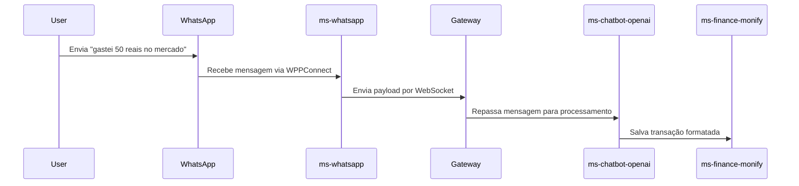

# 💸 Monify — Controle suas Finanças com Inteligência

O **Monify** é um aplicativo de finanças pessoais que une **design minimalista**, **tecnologia moderna** e **automação via chatbot** para ajudar o usuário a **entender, controlar e planejar sua vida financeira com facilidade**.

---

## 🧠 Motivação do Projeto
Desenvolvido com foco em resolver um problema real de maneira inteligente e escalável.
Criei o Monify como um projeto autoral para aplicar e consolidar conhecimentos práticos em:

- Arquitetura de microsserviços

- Integração com inteligência artificial (OpenAI)

- Orquestração com Docker

- APIs RESTful seguras e bem definidas

- Práticas modernas de Dev/Prod

---

## 🚀 Funcionalidades Principais

- 📊 **Dashboard intuitiva**: visualize gastos, receitas e saldo em tempo real.
- 🤖 **Chatbot inteligente**: registre transações com linguagem natural via WhatsApp.
- 💬 **Histórico de mensagens**: o sistema salva interações para respostas mais naturais e contextualizadas.
- 🔐 **Arquitetura segura e escalável**: baseada em microsserviços com autenticação e integração modular.

---

## ⚙️ Pré-requisitos

Antes de rodar o projeto, você precisará de:

- ✅ Token da OpenAI
- ✅ Configuração do **WPPConnect** integrada ao microserviço `ms-whatsapp`
- ✅ Java 17
- ✅ Docker e Docker Compose
- ✅ Node.js 18+
- ✅ Postgres (pode ser pelo Docker)

---

## 🛠️ Tecnologias Utilizadas

### Backend — *Java + Spring Boot + Microsserviços*
- Java 17 + Spring Boot 3
- Spring Cloud Gateway (API Gateway)
- Eureka Discovery Server (Service Discovery)
- WebSocket + STOMP (Comunicação em tempo real)
- PostgreSQL
- Testcontainers + JUnit
- Docker + Docker Compose

### Outros
- WPPConnect (WhatsApp Web automation)
- OpenAI API (GPT-4-turbo)
- REST APIs com padrão RESTful

---

## 🤖 Como funciona o Chatbot?

